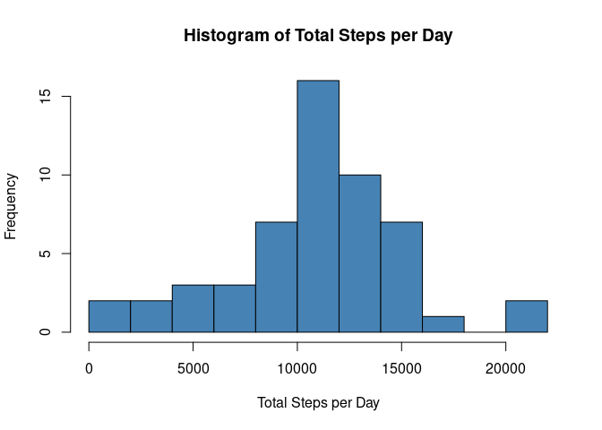
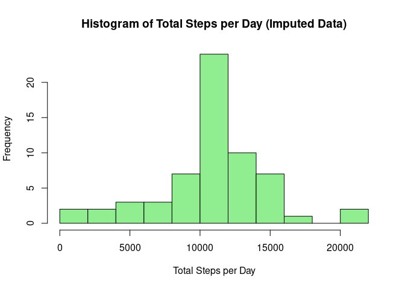
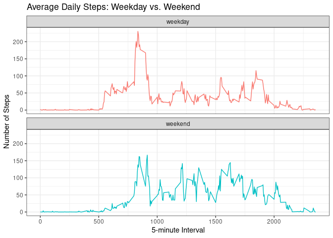

## Loading and preprocessing the data

```r
# Unzip the file
unzip("activity.zip")

# Load the data
activity <- read.csv("activity.csv")

# Show the first few rows
head(activity)
```

```
##   steps       date interval
## 1    NA 2012-10-01        0
## 2    NA 2012-10-01        5
## 3    NA 2012-10-01       10
## 4    NA 2012-10-01       15
## 5    NA 2012-10-01       20
## 6    NA 2012-10-01       25
```

## What is mean total number of steps taken per day?

```r
# 1. Calculate the total number of steps taken per day (ignoring NAs)
total_steps_per_day <- aggregate(steps ~ date, data = activity, FUN = sum, na.rm = TRUE)

# 2. Make a histogram of the total number of steps taken each day
hist(total_steps_per_day$steps, 
     main = "Histogram of Total Steps per Day", 
     xlab = "Total Steps per Day", 
     col = "steelblue", 
     breaks = 10)
```

<!-- -->

```r
# 3. Calculate and report the mean and median of the total number of steps taken per day
mean_steps <- mean(total_steps_per_day$steps)
median_steps <- median(total_steps_per_day$steps)

# Print the results
mean_steps
```

```
## [1] 10766.19
```

```r
median_steps
```

```
## [1] 10765
```

## What is the average daily activity pattern?

```r
# 1. Calculate average steps per 5-minute interval across all days
average_steps_per_interval <- aggregate(steps ~ interval, data = activity, FUN = mean, na.rm = TRUE)

# Make a time series plot
plot(average_steps_per_interval$interval, average_steps_per_interval$steps, 
     type = "l", 
     main = "Average Daily Activity Pattern", 
     xlab = "5-minute Interval", 
     ylab = "Average Number of Steps",
     col = "darkblue",
     lwd = 2)
```

<!-- -->

```r
# 2. Find the 5-minute interval with the maximum average number of steps
max_interval <- average_steps_per_interval$interval[which.max(average_steps_per_interval$steps)]

# Print the 5-minute interval that contains the maximum number of steps
max_interval
```

```
## [1] 835
```


## Imputing missing values

```r
# 1. Calculate and report the total number of missing values
total_nas <- sum(is.na(activity$steps))
print(paste("Total missing values:", total_nas))
```

```
## [1] "Total missing values: 2304"
```

```r
# 2 & 3. Devise a strategy and create a new dataset with filled in values
# Strategy: Use the mean for that 5-minute interval (calculated in the previous step)
activity_imputed <- activity
na_index <- is.na(activity_imputed$steps)

# Match the intervals of the NA rows to the interval means and replace them
interval_means <- average_steps_per_interval$steps[match(activity_imputed$interval[na_index], average_steps_per_interval$interval)]
activity_imputed$steps[na_index] <- interval_means

# 4. Make a histogram of the total number of steps taken each day
total_steps_imputed <- aggregate(steps ~ date, data = activity_imputed, FUN = sum)

hist(total_steps_imputed$steps, 
     main = "Histogram of Total Steps per Day (Imputed Data)", 
     xlab = "Total Steps per Day", 
     col = "lightgreen", 
     breaks = 10)
```

<!-- -->

```r
# 5. Calculate and report the mean and median total number of steps taken per day
mean_imputed <- mean
```


## Are there differences in activity patterns between weekdays and weekends?

```r
# Load ggplot2 for the panel plot
library(ggplot2)

# 1. Create a new factor variable in the dataset with two levels – “weekday” and “weekend”
# First, ensure the date column is in Date format
activity_imputed$date <- as.Date(activity_imputed$date)

# Determine if the day is a weekend or weekday
activity_imputed$day_type <- ifelse(weekdays(activity_imputed$date) %in% c("Saturday", "Sunday"), "weekend", "weekday")

# Convert the new column to a factor
activity_imputed$day_type <- as.factor(activity_imputed$day_type)

# 2. Make a panel plot containing a time series plot
# Calculate average steps per interval and day_type
average_steps_by_day_type <- aggregate(steps ~ interval + day_type, data = activity_imputed, FUN = mean)

# Create the panel plot
ggplot(average_steps_by_day_type, aes(x = interval, y = steps, color = day_type)) +
  geom_line() +
  facet_wrap(~day_type, ncol = 1, nrow = 2) +
  labs(title = "Average Daily Steps: Weekday vs. Weekend", 
       x = "5-minute Interval", 
       y = "Number of Steps") +
  theme_bw() +
  theme(legend.position = "none")
```

<!-- -->
